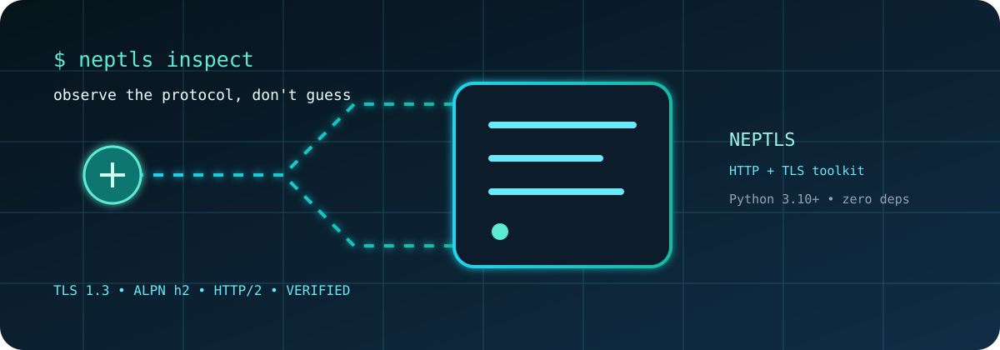
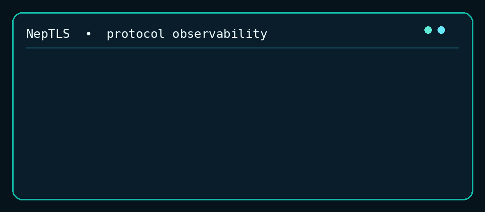

# NepTLS

<p align="center">
  <strong>Clear, inspectable HTTP and TLS tooling for Python.</strong><br />
  A dependency-light client for protocol research, browser-compatible headers, diagnostics, and authorized automation.
</p>

<p align="center">
  <a href="https://pypi.org/project/neptls/"></a>
  <a href="https://pypi.org/project/neptls/"></a>
  <a href="https://github.com/DiwasKhatri07/NepTLS/actions/workflows/ci.yml"></a>
  <a href="https://github.com/DiwasKhatri07/NepTLS/blob/main/LICENSE"></a>
  <a href="https://nep-tls-python-package--khatrieex.replit.app/"></a>
</p>

<p align="center">
  <a href="https://nep-tls-python-package--khatrieex.replit.app/">Read the docs</a> ·
  <a href="https://pypi.org/project/neptls/">Install from PyPI</a> ·
  <a href="https://github.com/DiwasKhatri07/NepTLS/issues">Open an issue</a>
</p>

<p align="center">
  
</p>

<p align="center">
  
</p>

<div align="center">

[](https://pypi.org/project/neptls/)
[](https://pypi.org/project/neptls/)
[](https://github.com/DiwasKhatri07/NepTLS/stargazers)
[](https://github.com/DiwasKhatri07/NepTLS/commits/main)

</div>

## Why NepTLS?

NepTLS is built for engineers who need to see what happened on the wire instead of
guessing. The default client stays portable and auditable with Python's standard
library, while optional native transports make HTTP/2 and HTTP/3 available when
your platform and dependencies support them.

## Live resources

| Resource | Link |
| --- | --- |
| Documentation website | [neptls-docs.replit.app](https://nep-tls-python-package--khatrieex.replit.app/) |
| PyPI package | [neptls 0.4.1](https://pypi.org/project/neptls/) |
| Canonical repository | [github.com/DiwasKhatri07/NepTLS](https://github.com/DiwasKhatri07/NepTLS) |
| Releases | [GitHub Releases](https://github.com/DiwasKhatri07/NepTLS/releases) |
| Issues | [GitHub Issues](https://github.com/DiwasKhatri07/NepTLS/issues) |

## Repository pulse

Public repository metrics are refreshed daily by [the metrics workflow](.github/workflows/repo-metrics.yml) and stored in [`docs/metrics.json`](docs/metrics.json).

| Signal | Where to follow it |
| --- | --- |
| Stars and forks | [GitHub repository](https://github.com/DiwasKhatri07/NepTLS) |
| Releases | [Release history](https://github.com/DiwasKhatri07/NepTLS/releases) |
| Development activity | [Commit history](https://github.com/DiwasKhatri07/NepTLS/commits/main) |

```python
import neptls

response = neptls.get(
    "https://example.com",
    impersonate="chrome",
    timeout=10,
)

response.raise_for_status()
print(response.status_code, response.http_version)
```

## Highlights

| Area | What is included |
| --- | --- |
| HTTP | `get`, `post`, `put`, `patch`, `delete`, `head`, `options`, JSON, forms, multipart, streaming |
| Client state | Reusable clients, cookies, redirects, retries, compression, auth hooks, proxies |
| Async | `AsyncClient` with the same request model and response conveniences |
| Browser compatibility | Curated Chrome, Firefox, Edge, Safari, desktop, and mobile profiles |
| TLS | Explicit `TLSConfig`, ALPN, certificate verification, TLS probing, JA3-compatible fields |
| Transports | Dependency-free HTTP/1.1 plus explicit optional HTTP/2 and HTTP/3 adapters |
| Diagnostics | DNS, TCP, TLS, HTTP, transport availability, timing, and failure context |
| Utilities | User-agent parsing, URL/cookie helpers, hashing, encoding, pools, and generic PoW |
| CLI | Requests, profiles, user agents, diagnostics, hashing, PoW, and version inspection |

## Install

Core NepTLS has **zero runtime dependencies** and supports Python 3.10–3.14.

```bash
python -m pip install --upgrade neptls
```

Optional native transports:

```bash
# HTTP/2 through httpx + hyper-h2
python -m pip install "neptls[http2]"

# HTTP/3 through curl-cffi + platform QUIC support
python -m pip install "neptls[http3]"

# Both optional transports
python -m pip install "neptls[native]"
```

## Quick examples

### Requests and reusable clients

```python
import neptls

client = neptls.Client(
    profile="chrome-windows",
    retries=2,
    timeout=20,
    headers={"X-Research-Client": "neptls"},
)

response = client.get("https://httpbin.org/headers")
print(response.status_code)
print(response.json())
```

### JSON, auth, and multipart

```python
from neptls import BasicAuth, BearerAuth

client.post(
    "https://httpbin.org/post",
    json={"ready": True},
    auth=BearerAuth("token"),
)

client.get(
    "https://httpbin.org/basic-auth/user/pass",
    auth=BasicAuth("user", "pass"),
)

client.post(
    "https://example.com/upload",
    form={"description": "research report"},
    files={"document": ("report.txt", b"hello", "text/plain")},
)
```

### Async requests

```python
import asyncio
from neptls import AsyncClient

async def main():
    async with AsyncClient(impersonate="chrome", timeout=10) as client:
        response = await client.get("https://example.com")
        response.raise_for_status()
        print(response.status_code, response.text[:80])

asyncio.run(main())
```

### Streaming

```python
with neptls.get("https://example.com/large-file", stream=True) as response:
    for chunk in response.iter_bytes(64 * 1024):
        process(chunk)
```

### Explicit HTTP/2 or HTTP/3

```python
from neptls import Client, transport_available

transport = "http2" if transport_available("http2") else "http1"
client = Client(transport=transport)
response = client.get("https://example.com")

print(response.http_version)
print(response.timing.total)
```

NepTLS does not silently downgrade a requested native transport. If a selected
backend is unavailable, it raises `TransportUnavailableError` unless you
explicitly opt into fallback behavior.

### TLS configuration and inspection

```python
from neptls import TLSConfig, TLSFingerprint, probe_tls

config = TLSConfig(
    minimum_version="TLSv1.2",
    alpn_protocols=("h2", "http/1.1"),
    verify=True,
)

local = TLSFingerprint.from_config(config)
negotiated = probe_tls("example.com")

print(local.digest, local.ja3_hash)
print(negotiated.version, negotiated.cipher, negotiated.alpn)
```

`Client.fingerprint()` describes configured local state. `probe_tls()` performs
a real verified handshake. Neither claims byte-identical browser ClientHello
generation.

### User agents and profiles

```python
import neptls

print(neptls.ua.chrome())
print(neptls.ua.mobile())
print(neptls.profiles.get_profile("chrome-windows").to_json())
print(neptls.user_agents.parse(neptls.ua.random()))
```

The built-in user-agent catalog is intentionally curated. Load a properly
licensed dataset into `UserAgentDatabase` when your application needs more
entries; NepTLS does not bundle a copied third-party mega-list.

### Diagnostics, hashing, and generic PoW

```python
import neptls
from neptls.crypto import sha256
from neptls.pow import Challenge, solve_parallel

report = neptls.inspect("https://example.com")
print(report["tls"]["version"])
print(sha256("protocol message"))

challenge = Challenge("demo", difficulty=3, algorithm="sha256")
print(solve_parallel(challenge, workers=2))
```

The PoW helpers are generic protocol-research primitives. They are not tied to
CAPTCHA solving, anti-abuse evasion, or access-control bypass.

## CLI

```bash
neptls version
neptls get https://example.com
neptls get https://example.com --header "Accept: application/json"
neptls inspect https://example.com
neptls profile chrome-windows
neptls ua mobile
neptls hash "protocol message" --algorithm sha256
neptls pow demo --difficulty 3
```

## Transport matrix

| Transport | Default | Extra | Multiplexing | Unavailable behavior |
| --- | ---: | --- | ---: | --- |
| HTTP/1.1 | Yes | None | No | Always available |
| HTTP/2 | No | `neptls[http2]` | Yes | Explicit error |
| HTTP/3 | No | `neptls[http3]` | Yes | Explicit error |

## Security boundary

NepTLS is for systems you own or are explicitly authorized to test. It supports
HTTP compatibility, TLS inspection, diagnostics, performance testing, protocol
research, and defensive automation.

It intentionally does **not** provide:

- CAPTCHA solving or anti-abuse evasion
- Credential attacks or password guessing
- Session theft or authentication bypass
- Payment-security bypass
- Tools intended to defeat access controls

Browser profiles describe compatible headers and metadata. They do not promise
browser TLS spoofing or a way around a security control.

## Project layout

```text
src/neptls/          Core Python package
tests/               Standard-library unittest suite
docs/                Long-form API and practical wiki
.github/             CI, release automation, metrics, and community health files
```

## Development

```bash
git clone https://github.com/DiwasKhatri07/NepTLS.git
cd NepTLS

PYTHONPATH=src python -m unittest discover -s tests -v
PYTHONPATH=src python -m compileall -q src

python -m pip install build
python -m build --sdist --wheel
python -m twine check dist/*
```

Before opening a pull request, read [CONTRIBUTING.md](CONTRIBUTING.md),
[SECURITY.md](SECURITY.md), and the [Code of Conduct](CODE_OF_CONDUCT.md).

## Documentation

- **Live docs:** [neptls-docs.replit.app](https://nep-tls-python-package--khatrieex.replit.app/)
- **API guide:** [docs/api.md](docs/api.md)
- **Practical wiki:** [docs/wiki.md](docs/wiki.md)
- **Release history:** [CHANGELOG.md](CHANGELOG.md)
- **Latest test report:** [TEST_REPORT.md](TEST_REPORT.md)

## License and credits

NepTLS is released under the [MIT License](LICENSE).

Developed by **Diwas Khatri** — [@DiwasKhatri07](https://github.com/DiwasKhatri07).

See [CONTRIBUTORS.md](CONTRIBUTORS.md) for credits. If you search for **NepTLS Diwas Khatri**, this repository is the canonical source and release home.
